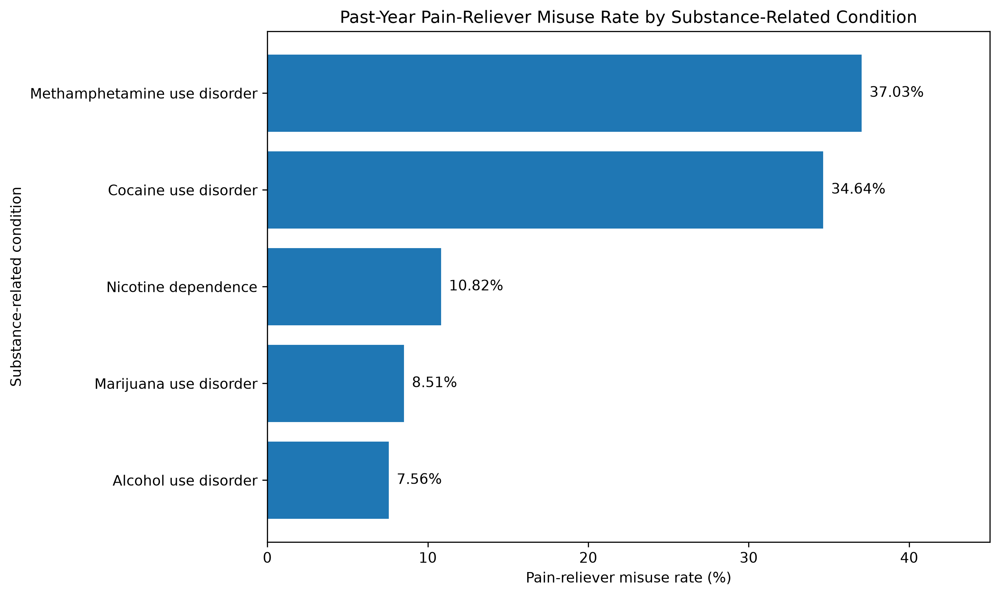
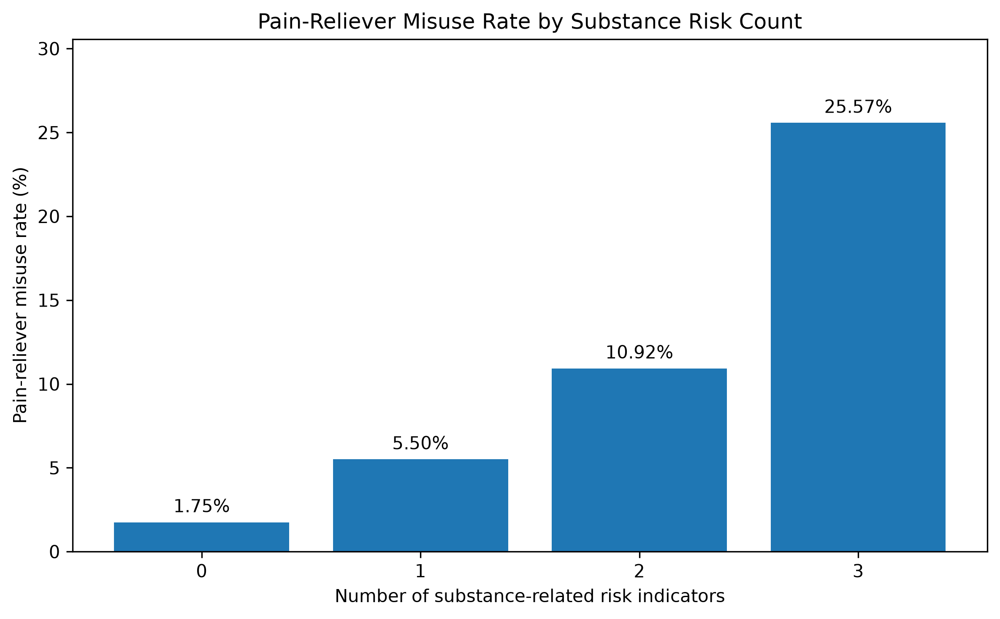
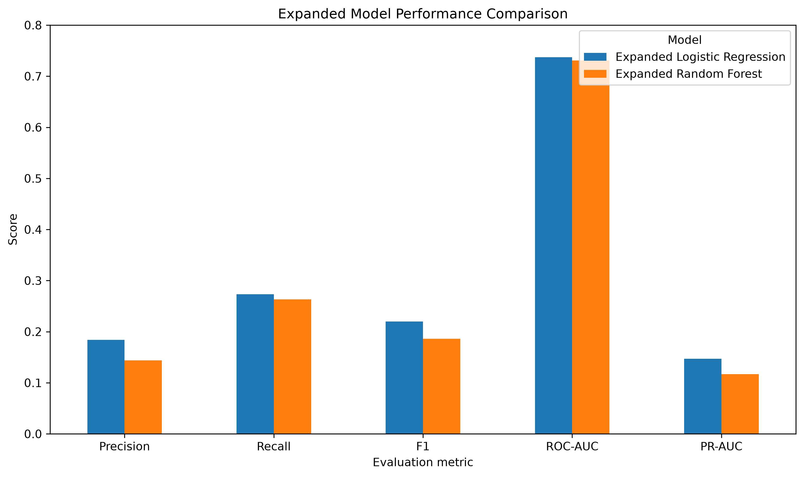
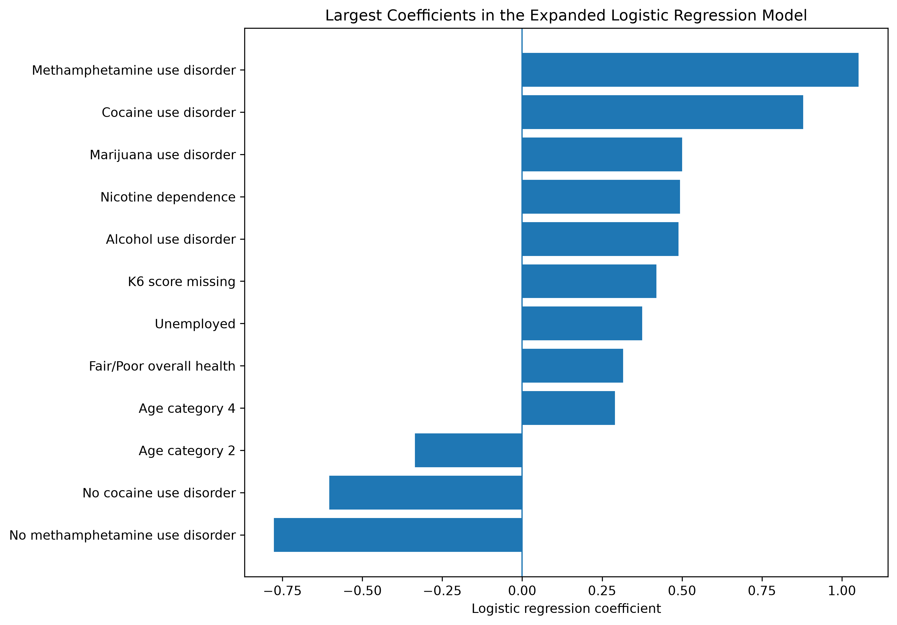
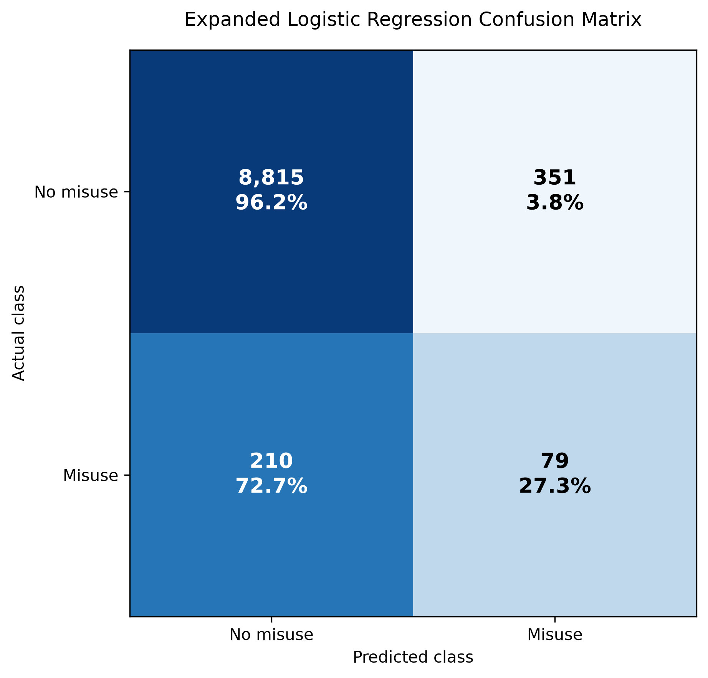

# nsduh-pain-reliever-misuse-analysis
Classification and exploratory analysis of past-year prescription pain-reliever misuse among U.S. adults using the 2024 NSDUH public-use dataset.

# Predicting Prescription Pain-Reliever Misuse Using 2024 NSDUH Data

## Project Overview

This self-directed data analytics project examines which demographic, socioeconomic, health, mental-health, and substance-use characteristics are associated with **past-year prescription pain-reliever misuse among U.S. adults** using the 2024 National Survey on Drug Use and Health (NSDUH) public-use file.

This project demonstrates:

- codebook-guided variable selection
- data cleaning and validation
- exploratory data analysis
- statistical association testing
- feature engineering
- handling severe class imbalance
- logistic regression and random forest classification
- validation-based threshold tuning
- model comparison and interpretation
- communication of analytical limitations

> **Important:** NSDUH is cross-sectional. The models in this project classify contemporaneous past-year reported misuse; they do not establish causation or predict future misuse.

---

## Research Question

**Which selected demographic, socioeconomic, health, mental-health, and substance-use characteristics are associated with past-year prescription pain-reliever misuse, and how effectively can classification models distinguish respondents who report misuse from those who do not?**

## Report and Current Status

A business-facing project report is included to summarize the analytical objective, methodology, key findings, model performance, limitations, and recommended next steps.

The current analysis identified several meaningful patterns, particularly among substance-use and behavioral-health variables. Methamphetamine use disorder and cocaine use disorder emerged as two of the strongest model contributors, while nicotine dependence, marijuana use disorder, alcohol use disorder, psychological distress, and functional impairment also provided useful signal.

However, the modeling results should be considered **development-stage rather than final predictive performance**.

The expanded logistic regression improved on earlier model versions and outperformed the random forest on several evaluation metrics, but positive-class performance remained limited. At the selected threshold, recall was approximately 27% and precision approximately 18%, meaning that many respondents reporting past-year prescription pain-reliever misuse were still not identified and a substantial proportion of positive predictions were false positives.

Because of these limitations, the current model is best viewed as evidence that the selected features contain useful classification signal rather than as a finished prediction system.

This project is therefore considered complete as a first portfolio version, while the analytical findings remain open to refinement through additional feature exploration, stronger validation methods, and future model development.
---

## Data Source

**Dataset:** 2024 National Survey on Drug Use and Health (NSDUH) Public-Use File  
**Source:** Substance Abuse and Mental Health Services Administration (SAMHSA)

Official NSDUH data files:  
https://www.samhsa.gov/data/data-we-collect/nsduh-national-survey-drug-use-and-health/datafiles

The raw NSDUH dataset is not included in this repository. The notebook is designed to read the official 2024 public-use TSV bundle after it is downloaded locally.

## Analysis Notebook

[View the full analysis notebook](Notebook.ipynb)

### Analytical Sample

- Full public-use file: **58,633 respondents**
- Analysis restricted to adults age 18+
- Final cleaned analytical sample: **47,274 adults**
- Target variable: `PNRNMYR`
  - `0` = no reported past-year prescription pain-reliever misuse
  - `1` = reported past-year prescription pain-reliever misuse
- Positive class in the adult analytical sample: approximately **3%**

Because the outcome is rare, model evaluation emphasizes precision, recall, F1, ROC-AUC, PR-AUC, and confusion matrices rather than accuracy alone.

---

## Variable Selection

The original NSDUH public-use file contains more than 2,600 variables.

Candidate predictors were selected through targeted review of the official NSDUH codebook rather than by automatically modeling every available field.

The final expanded feature set included:

### Demographic and Socioeconomic
- age category
- education
- employment status
- household income

### Health and Mental Health
- self-rated overall health
- K6 psychological distress score
- K6 missingness indicator
- WHODAS functional impairment score

### Substance-Related Measures
- nicotine dependence
- alcohol use disorder
- marijuana use disorder
- methamphetamine use disorder
- cocaine use disorder

Variables that directly encoded prescription pain-reliever misuse, misuse reasons, or pain-reliever use disorder were excluded to reduce **target leakage**.

---

## Data Preparation

Key preparation steps included:

- filtering to adults age 18+
- validating respondent IDs and duplicate rows
- reviewing special missing and skip codes using the NSDUH codebook
- replacing selected raw variables with official imputation-revised variables
- retaining usable observations with missing mental-health scores
- creating missingness indicators where appropriate
- fitting preprocessing only on training data
- using stratified train, validation, and test splits because of class imbalance

`QUESTID2` was retained for traceability but excluded from modeling.

---

## Exploratory Findings

Several substance-related conditions showed substantially higher rates of reported past-year prescription pain-reliever misuse.

| Substance-related condition | Misuse rate |
|---|---:|
| Alcohol use disorder | 7.56% |
| Marijuana use disorder | 8.51% |
| Nicotine dependence | 10.82% |
| Cocaine use disorder | 34.64% |
| Methamphetamine use disorder | 37.03% |

Methamphetamine and cocaine use disorder were identified during a targeted second review of the NSDUH codebook and became two of the strongest predictors in the expanded logistic regression model.

---

## Substance Risk Count

A descriptive feature was engineered from nicotine dependence, alcohol use disorder, and marijuana use disorder.

| Number of risk indicators | Pain-reliever misuse rate |
|---:|---:|
| 0 | 1.75% |
| 1 | 5.50% |
| 2 | 10.92% |
| 3 | 25.57% |

This feature showed a clear stepwise descriptive pattern, although it did not improve model performance compared with retaining the individual substance-use variables.

---

## Statistical Methods

The analysis used:

- chi-square tests
- Cramér's V
- point-biserial correlation
- Mann-Whitney U tests
- correlation checks for potential predictor redundancy

Because the sample is large, statistical significance was interpreted alongside effect size.

---

## Modeling Approach

The project compared:

- Logistic Regression
- Random Forest
- AdaBoost

Because the target is highly imbalanced, class weighting and decision-threshold tuning were used to improve minority-class detection.

### Expanded Logistic Regression

- class weight: `{0: 1, 1: 10}`
- validation-selected classification threshold: **0.50**

### Expanded Random Forest

- 300 trees
- balanced class weights
- maximum depth: 10
- minimum samples per leaf: 25
- `max_features="sqrt"`
- validation-selected classification threshold: **0.70**

---

## Final Development Results

| Metric | Expanded Logistic Regression | Expanded Random Forest |
|---|---:|---:|
| Accuracy | 0.941 | 0.929 |
| Precision | **0.184** | 0.144 |
| Recall | **0.273** | 0.263 |
| F1 | **0.220** | 0.186 |
| ROC-AUC | **0.737** | 0.731 |
| PR-AUC | **0.147** | 0.117 |

In the current development workflow, the expanded logistic regression provided the strongest overall balance of model performance.

### Logistic Regression Confusion Matrix

At the selected threshold of 0.50:

- True negatives: **8,815**
- False positives: **351**
- False negatives: **210**
- True positives: **79**

---

## Model Interpretation

The largest positive logistic-regression coefficients included:

- methamphetamine use disorder
- cocaine use disorder
- marijuana use disorder
- nicotine dependence
- alcohol use disorder

These coefficients should be interpreted as **model contributions**, not causal effects.

Because all one-hot categories were retained in the preprocessing pipeline, the coefficients are not presented as conventional reference-category odds ratios.

---
## Project Report

[View the full project report](Report.pdf)

## Project Visuals

### Pain-Reliever Misuse by Substance-Related Condition

### Pain-Reliever Misuse by Substance Risk Count

### Model Performance Comparison

### Largest Logistic Regression Coefficients

### Logistic Regression Confusion Matrix

---

## Tools and Libraries

- Python
- pandas
- NumPy
- SciPy
- scikit-learn
- Matplotlib
- Jupyter Notebook

- ## How to Run

1. Download the 2024 NSDUH public-use TSV bundle from SAMHSA.
2. Place the ZIP file in your local Downloads folder, or update the `zip_path` variable in the notebook.
3. Open `nsduh_pain_reliever_misuse_analysis.ipynb` in Jupyter Notebook.
4. Run the notebook from top to bottom.

The analysis expects the official NSDUH ZIP file:

`NSDUH-2024-DS0001-bndl-data-tsv_v1.zip`

---

## Limitations

- NSDUH is cross-sectional, so associations cannot be interpreted as causal.
- The target is rare, making minority-class prediction difficult.
- Survey weights were retained for descriptive analysis but were not used as ordinary model predictors.
- The machine-learning models are not presented as nationally representative clinical prediction tools.
- Feature selection was targeted rather than exhaustive across all 2,600+ available variables.
- Several behavioral-health predictors may contain overlapping information.
- The test partition was examined during iterative model development, so reported test metrics should be treated as development evidence rather than a pristine untouched final performance estimate.
- This model is **not intended for clinical screening, diagnosis, treatment decisions, or individual-level risk assessment**.

---

## Future Work

Future versions of this project may:

- conduct a broader codebook-guided feature search
- evaluate additional behavioral-health and healthcare predictors
- compare alternative feature-selection methods
- use repeated stratified or nested cross-validation
- reserve a fresh final holdout for unbiased performance estimation
- explore calibrated probabilities
- create a Power BI dashboard or presentation

---

